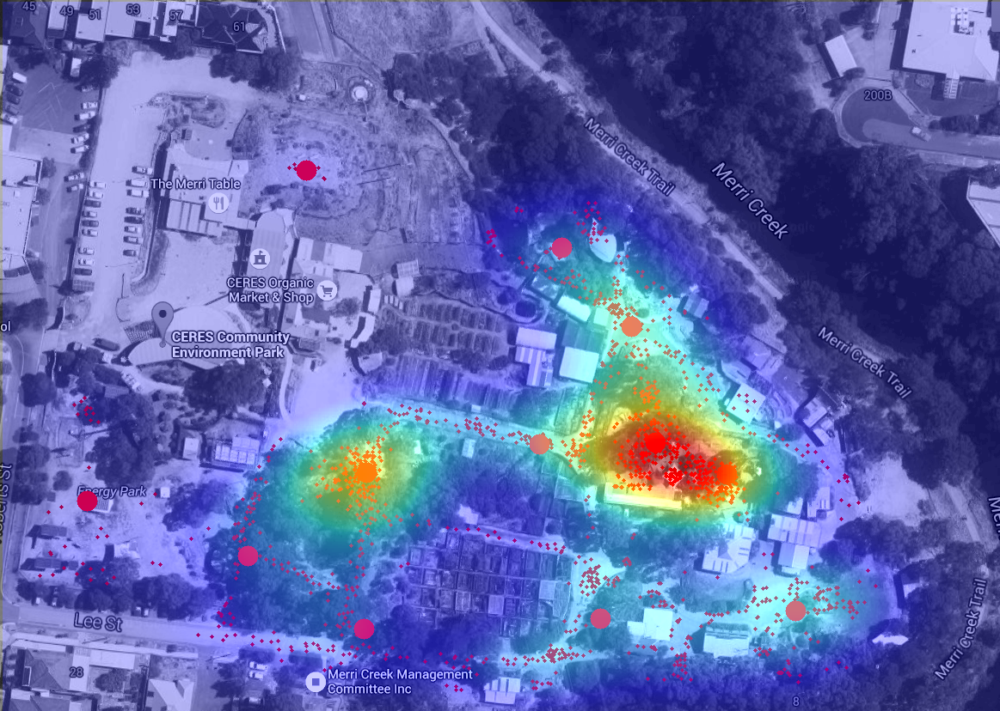

#IQP

A method for the Worcester Polytechnic Institute (WPI) Interactive Qualifying Project (IQP), Melbourne-B15: Team CERES.
Used to analyze the locations of CERES park visitors to find hotspots.

Author: Nicholas S. Bradford

##Description

Takes a satellite image from /images to use as a reference base. Then, generate a point cloud by recording all changed pixels between the base and the /observations observation images (park visitor locations marked on the map). Using this point cloud, apply the KMeans clustering algorithm to find centroids, and a gaussian distribution to create Heatmap. Finally, blend with base image and save to /output. Original satellite image size and file names are hard-coded in as globals.

Dependencies: opencv, scikit-learn, matplotlib, PIL

##Usage

    iqp.py [-h] [-o N_OBSERVATIONS] [-c N_CLUSTERS] [-b N_BINS]
    optional arguments:
      -h, --help            show this help message and exit
      -o N_OBSERVATIONS, --n_observations N_OBSERVATIONS
                            number of observation files
      -c N_CLUSTERS, --n_clusters N_CLUSTERS
                            number of clusters to generate with KMeans
      -b N_BINS, --n_bins N_BINS
                            number of bins to use for the Heatmap

##Data Collection Method for CERES

You will need at least 4-5 participants for data collection to cover the entire CERES park. Begin by making copies of "/images/satellite.png" and distributing them to each participant, who will then open the image using Microsoft Paint and select the Pencil tool (edits single pixels) with Red color (any non-greyscale color should work). Distribute the participants so that they combined have a view of the entire park, and assign them a specific area such that there is no overlap between participants. Then, every 2 minutes over the course of an hour (or longer), the participants use the pencil tool to mark the positions of all visitors in their area. 

After the set amount of time has elapsed, every participant returns their modified image file, which are moved to the /observations folder and renamed "observation_XX" (where XX is the 2-digit increasing number of the observation, starting with 01). Finally, run the program to produce the hotspot clusters and heatmap.

##Input

##Output

###EOF
